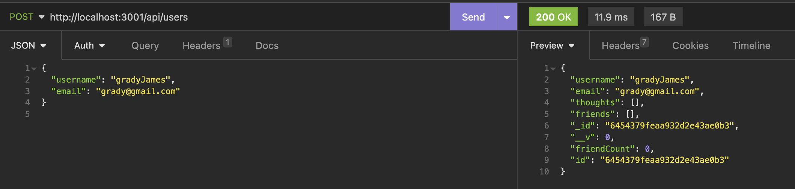
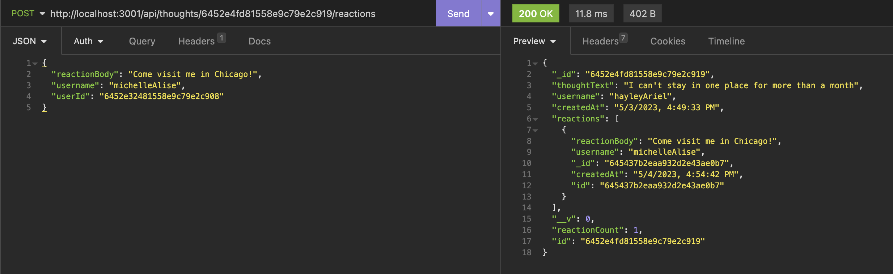
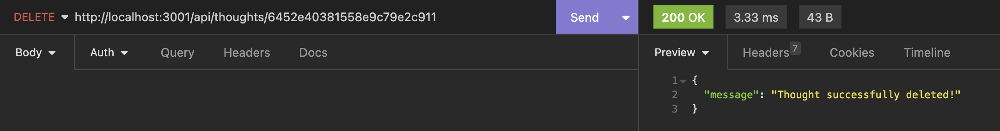
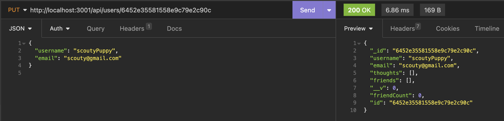

# Social Network API Backend  

  

  ## Description

  This social network back-end is built using Express.js for routing and MongoDB database with the Mongoose ODM. The API allows users to create an account and share their thoughts, as well as react to their friends' thoughts and create a list of friends. The application supports CRUD (Create, Read, Update, and Delete) operations for the different documents created. Overall, the API provides a robust and secure back-end for users to share their thoughts and connect with friends in a social network environment.
 

  ## Table of Contents

  - [Installation](#installation)
  - [Usage](#usage)
  - [License](#license)
  - [Badges](#badges)
  - [Credit](#credit)

  ## Installation

  1. Clone the code from https://github.com/boushka9/hive-mind

  2. Type `npm i` to install dependencies

  3. Type `npm run start` to start server and connect to the MongoDB
    * This application will run on `http://localhost:3001/` and should be tested using Insomnia
  

  ## Usage

  Walkthrough video: https://drive.google.com/file/d/1-Cx5Q-e9uHM9bEvMwB0eMjkc2mgggdV2/view?usp=sharing

  The database contains two documents: 

  1. User: The user model contains information about the user, such as their name, email, password, and friends list. The API provides endpoints to create, read, update, and delete user accounts.
    
    * GET request to `/api/users` for all users
    * POST/PUT/DELETE requests to `/api/users/:userId` to add/update/delete a single user by ID
    * POST/DELETE requests to `/api/:userId/friends/:friendId` to add or delete a friend from a user by their ID's
    

  2. Thought: The thought model represents a user's thought and contains the thought text, the user who created the thought, and the reactions to the thought. The API provides endpoints to create, read, update, and delete thoughts.

    * GET request to `/api/thoughts` for all thoughts
    * POST/PUT/DELETE requests to `/api/thoughts/:thoughtId` to add/update/delete a single thought by ID
    * POST/DELETE requests to `/api/thoughts/:thoughtId/reactions/:reactionId` to add or delete a reaction from a thought by their ID's

  ## Screenshots

  

    

    
  
    

  ## License

  This project is licensed under the terms of the MIT license 

  ---

  ## Badges

    
  
  
  

  
  ## Credit
  Tutoring session with Tucker Barrett enabled me to fix bugs preventing adding/deleting reactions to thoughts.

  ## Questions

  If you have any questions regarding this application please contact me through email or GitHub:

  boushka9@gmail.com

  boushka9